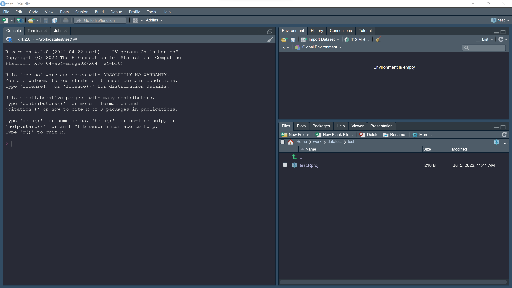
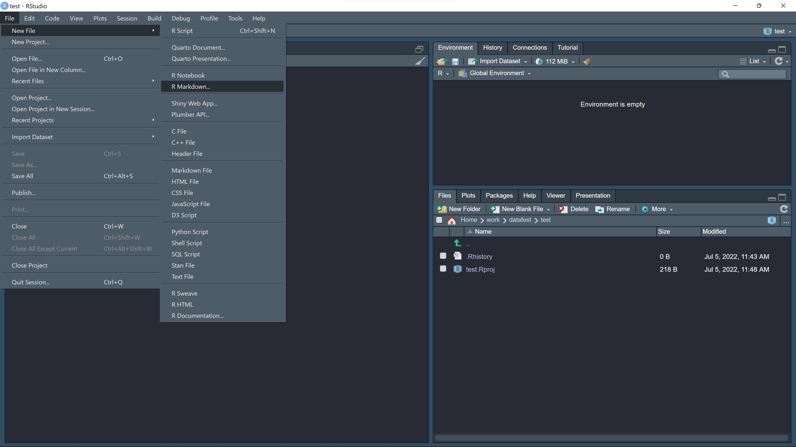
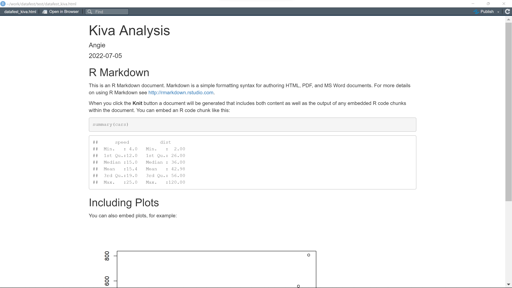
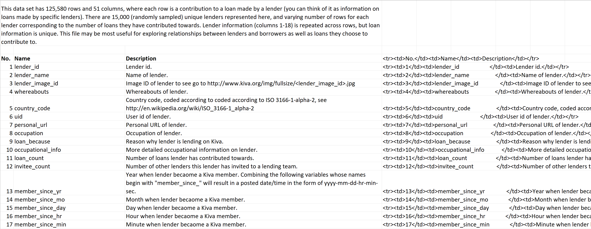
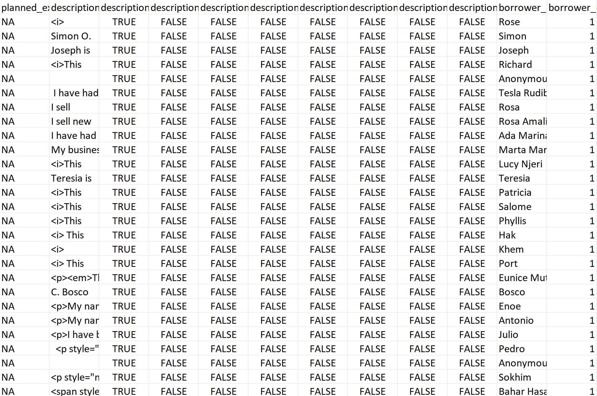

```{r setup, include=FALSE}
knitr::opts_chunk$set(echo = TRUE)
```

## Introduction

It's 6pm on the day of your first DataFest and you've just received your assignment: in approximately 48 hours, you will need to have cleaned your dataset, analyzed it, and collected your findings into a digestible slide format. This might seem daunting, especially if you're new to data analysis. But rest assured, with a little preparation DataFest can be a great experience - even for someone with limited statistical background. Here, we break the process down into several approachable steps by walking through one potential analysis on the 2012 DataFest dataset. By the end of this tutorial, you'll be fully equipped to dive into your DataFest journey.

## Preparation Phase

### Setting up R

First, you're going to need to choose a language and software. Python and R are two of the most popular choices for Data Science. For this tutorial, we'll be working in R.

To download R, go to this [link](https://cloud.r-project.org/) and choose the correct download option.

You should also [download](https://www.rstudio.com/products/rstudio/download/) RStudio. Once you've finished the download and opened RStudio, your IDE will look something like this:



Open an R Markdown file by clicking on File -\> New File -\> R Markdown.



This will open a file that looks like this:


This file will include some basic starter code examples, which you can delete and replace with your own.

If you'd like to see the rendered version, click the knit button. The knitted starter code looks like this:



For more in depth help with R and R Markdown, check out these resources:

-   [R for Data Science textbook](https://r4ds.had.co.nz/)
-   [R resource](https://cran.r-project.org/doc/contrib/Paradis-rdebuts_en.pdf)
-   [R Markdown tutorial](https://www.rstudio.com/resources/webinars/getting-started-with-r-markdown/)

### Collaborative Data Science

Since you'll be working in a collaborative setting for DataFest, you'll want to find a workflow that accommodates your entire team's needs. One great tool for this is GitHub, a code hosting platform for version control and collaboration. GitHub allows you to create a code repository shared among different collaborators. Everyone is able to make changes to the project and access each others changes.

This link offers an in-depth walkthrough on GitHub if you'd like more information: [GitHub walkthrough](https://docs.github.com/en/get-started/quickstart/hello-world)

For a project like this, it's a good idea to have everyone write individual code files with their assigned tasks. This can help minimize merge conflicts, which can take a lot of time to troubleshoot when files have multiple authors. It's also good practice to comment your code so your teammates can understand it. Make sure to knit frequently to share your progress as well!

## Getting Started

Now that we're all set up, we can assess the prompt and data we've been given to work with. In this tutorial, we'll be using the dataset from the 2012 DataFest event.

**The dataset:** In 2012, DataFest participants were asked to analyze a dataset provided by the San Francisco-based nonprofit, Kiva. Kiva is a microfinance organization which connects online lenders to entrepreneurs across the globe that might otherwise be excluded from conventional credit markets. The aim is to expand financial access to under served communities and help them thrive with the help of peer-to-peer lending.

**The prompt:** *Help understand what motivates people to lend money to developing-nation entrepreneurs and what factors are associated with paying these loans.*

To begin our work, we first take stock of the information we've been provided: the dataset involves 4 main files and 2 supplementary files, as well as a data dictionary - the data dictionary is a great place to start!

A data dictionary is a collection of names, definitions, and attributes about data elements that are being used or captured in a database, information system, or part of a research project. It describes the meanings and purposes of data elements within the context of a project, and provides guidance on interpretation, accepted meanings and representation.

This is what the Kiva data dictionary looks like:



Taking into account the outlined goal and provided data, you'll want to ask yourself what you intend to present by the end of your 48 hours. What questions do you want to answer? What visualizations will be appropriate?

At this step, we should browse the data to gain an understanding of what resources we have at our disposal and what analysis angles might make sense.

First let's import some libraries. These libraries allow you to access a broad range of data analysis tools not included in the base R package.

\*Make sure to call `install.packages("package_name")` in the console if you are getting package issues!

```{r, message=FALSE, warning=FALSE, results='hide'}
library("tidyverse")
```

Now, let's import the data. Make sure you've downloaded the data into the proper directory, then import it using the appropriate file path.

```{r, message=FALSE, warning=FALSE, results = 'hide'}
kiva_ll <- read_csv(("data/lender_loans.csv"))
kiva_lender <- read_csv(("data/lenders.csv"))
kiva_loan <- read_csv(("data/loans.csv"))
kiva_partner <- read_csv(("data/partners.csv"))
```

We can use the `head()` command to take a look at the downloaded data:

```{r}
head(kiva_loan)
```

For a clearer view of the entire dataframe, we can also open it up in Excel or any csv file viewer:


At a glance, we can see columns like status, activity, and sector. Some of these columns are self-explanatory. Others may require some additional googling to understand. For instance, you might ask what the difference between a borrower and a partner is, or you may need to google other industry specific terms.

Looking at this dataframe, you could examine how loans are given out over time, or what sectors receive the most funding. Maybe you can look at how geographical location impacts loans given or received.

When brainstorming these ideas, it's important to take into account what information your data does and doesn't include - missing or incomplete data is very common, and it may limit your analysis options. This brings us to our next topic: Data Cleaning.

## Data Cleaning

Before you start performing any analysis, you'll need to make sure the data is free of obvious errors and inconsistencies and formatted properly - a process known as data cleaning. What we've just imported is considered raw data, which may lack headers, contain nonsensical values, incomplete or duplicated data, inconsistent or inappropriate data types (e.g. numbers stored as strings), wrong category labels, and unknown or unexpected character encoding. These issues are caused by a variety of factors. For instance, data collected by surveys often includes inconsistent formatting or data type issues because users sometimes input information incorrectly. Keep an eye out for common problems such as duplicates, missing fields, and inconsistencies.

For more detailed information on data cleaning, check out this resource: [Data Cleaning with R](https://cran.r-project.org/doc/contrib/de_Jonge+van_der_Loo-Introduction_to_data_cleaning_with_R.pdf).

It's good practice to resolve these problems by modifying, replacing, or deleting corrupted or unusable data early on before conducting analysis, as they tend to cause more trouble the later they are addressed. However, it's important not to waste time in an event like this, and that means not cleaning data which we won't end up using. For that reason, now is a good time to make note of any problematic features in your data, but hold off on the actual cleaning until you have a more concrete plan.

As an example, let's return to the `kiva_loans` dataframe. If we scroll through it, we'll find that some columns seem to have a lot of NAs.



```{r}
apply(kiva_loan[, 1:10], 2, function(x) sum(is.na(x)))
```

It looks like some columns have a lot of NAs. These columns aren't going to help very much and can be dropped.

NOTE: I CHANGED THE CODE HERE TO LOOK AT THE FIRST TEN VARIABLES, COMMENT ON WHICH ONES HAVE A LOT OF NA'S AND MENTION THAT YOU WOULDN'T WANT TO WASTE TIME CLEANING THEM.

## Project Planning

### Rough Plan

So now you've taken a look at the prompt and data and have a general idea of what angle you would like to take for your analysis. Let's start by coming up with a rough plan.

First, let's revisit the prompt: *Help understand what motivates people to lend money to developing-nation entrepreneurs and what factors are associated with paying these loans.*

We can split the prompt into two main ideas: **money lending motivations** and **loan repayment factors**. You will probably want to create different models that focus on each of these themes. With that in mind, you can come up with a plan for what types of models you'll want to create and which models are feasible given the provided data.

As an example, the `kiva_loans` dataframe includes information on loan amounts and years. We can use this to see which years have the highest loan amounts as well as how loan amounts change over time. We also have geographical information for the loans - we could create a model to see where most loans are coming from or where they are given to. Take some time to think about the relationships you can observe and ask yourself which ones are the most relevant for the questions you want to answer.

HOW DOES LOOKING AT HOW LOAN AMOUNTS CHANGED OVER TIME, ETC. ADDRESS THE PROMPT?

Once you've determined the models you would like to create and present, you can start distributing tasks among your group and get to work!

### Timeline

So now you know a bit more about getting started with data analysis. How do we put it all together? Here is a sample timeline over 48 hours of what the work distribution might look like for a team of four members.

ARE TIMES START TIMES OR END TIMES. WHEN ARE THEY STOPPING EACH NIGHT? SOUNDS TOO LATE. LET'S REVISE THIS IN A MEETING.

### Friday

-   6:00 PM - kickoff!

-   7:00 PM - brainstorming session (all members)

-   8:00 PM - basic data cleaning (1 team member) - formatting variables - making sure missing conventions are consistent

-   10:00 PM - exploratory data analysis (all members)

### Saturday

-   9:00 AM - team check in, finalize topics to examine - finalize models to create

-   10:00 AM - split into teams of two - team 1 on model 1 - team 2 on model 2

-   12:00 PM - lunch break

-   12:30 PM - team 1 on model 1 - team 2 on model 2

-   5:00 PM - dinner break

-   6:00 PM - team check in

-   7:00 PM - team 1 on model 1 - team 2 on model 2

-   10:00 PM - start working on presentation (all members)

### Sunday

-   9:00 AM - finish presentation (all members) - run through presentation

-   12:00 PM - judging

The important takeaways:

Leave enough time to put together the presentation. Prioritize tasks so that you will have something to present at the end. Be clear about objectives and make sure everyone knows what they are working on.

Check in periodically to make sure you are staying on schedule. Don't be afraid to change plans - if you find yourself ahead of schedule, you might be able to incorporate other angles into your analysis. On the other hand, you might find that you won't be able to complete all the tasks you originally envisioned. That's alright! The most important thing is understanding what a realistic deliverable looks like for you and your team.

Good luck and have fun!
